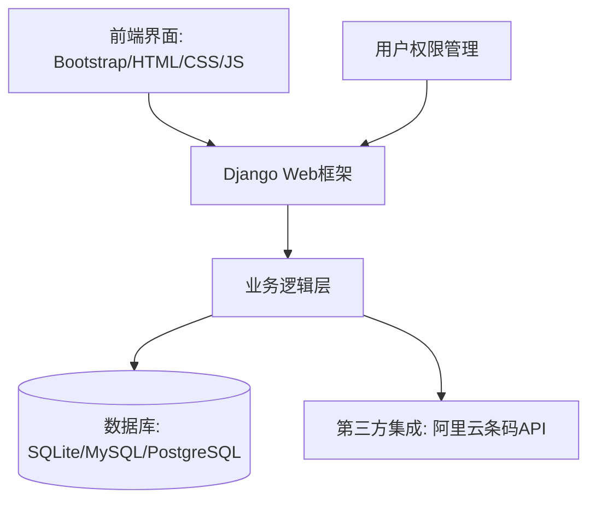
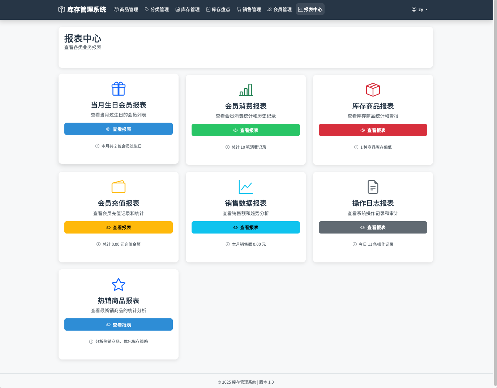
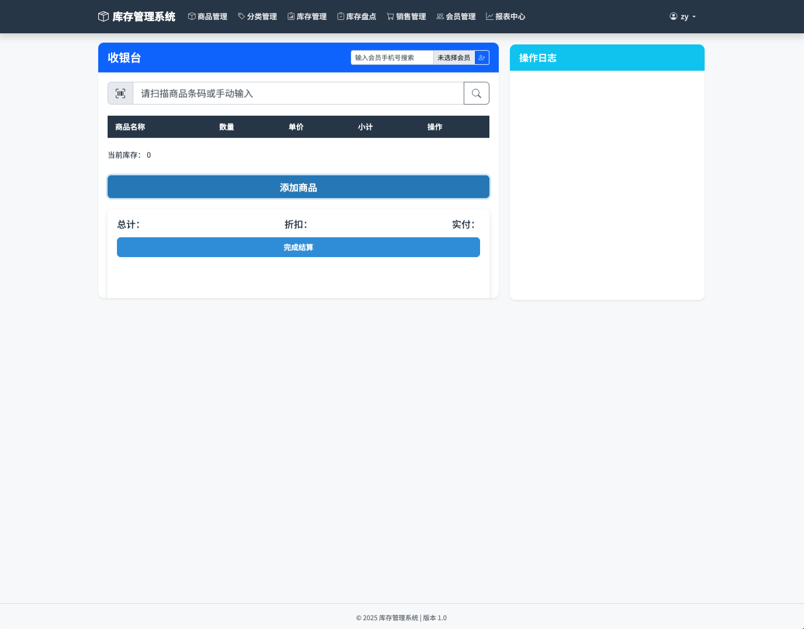
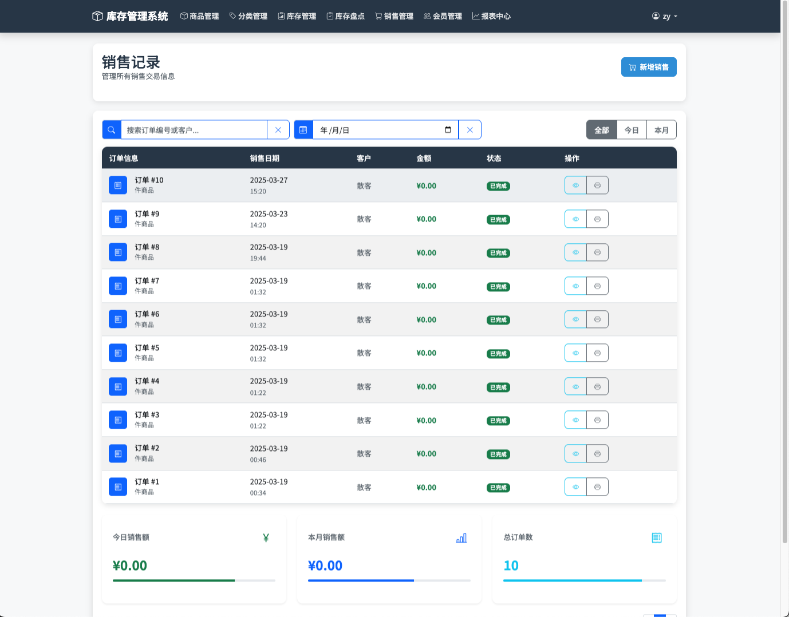
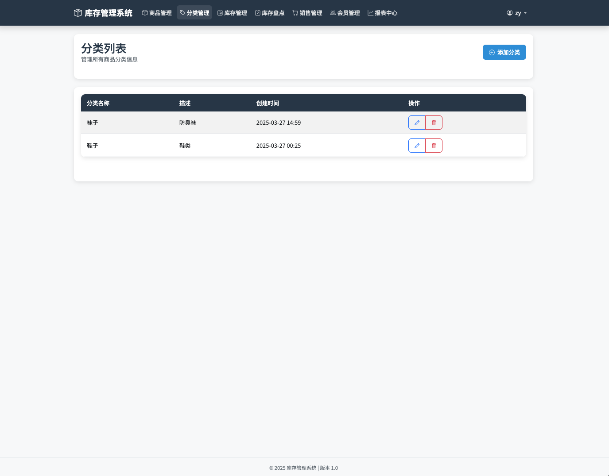
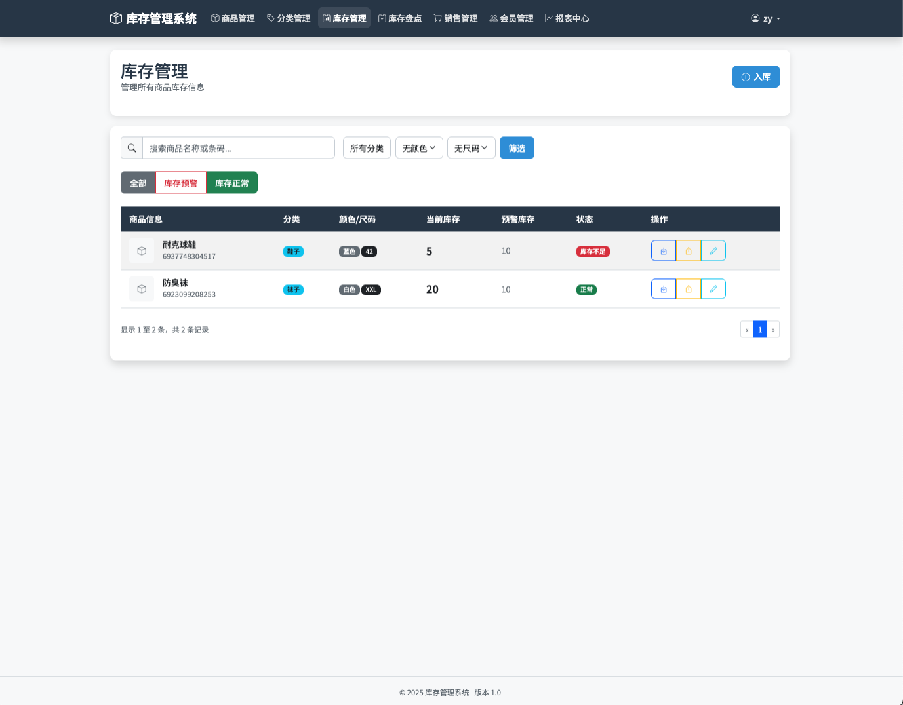
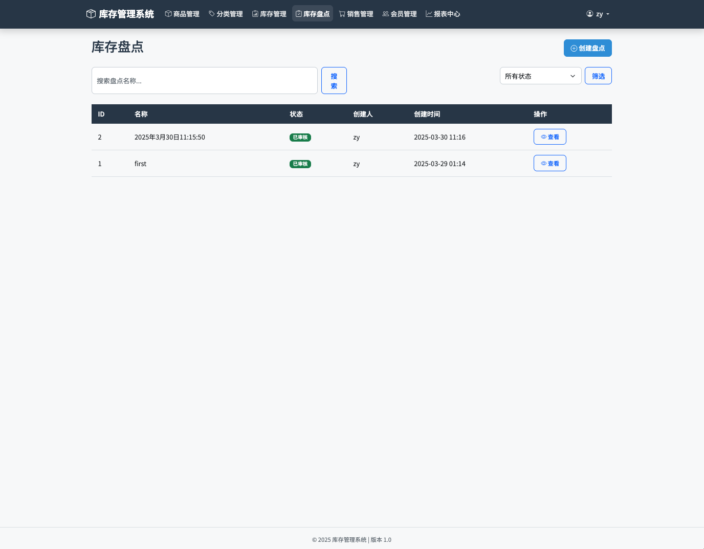
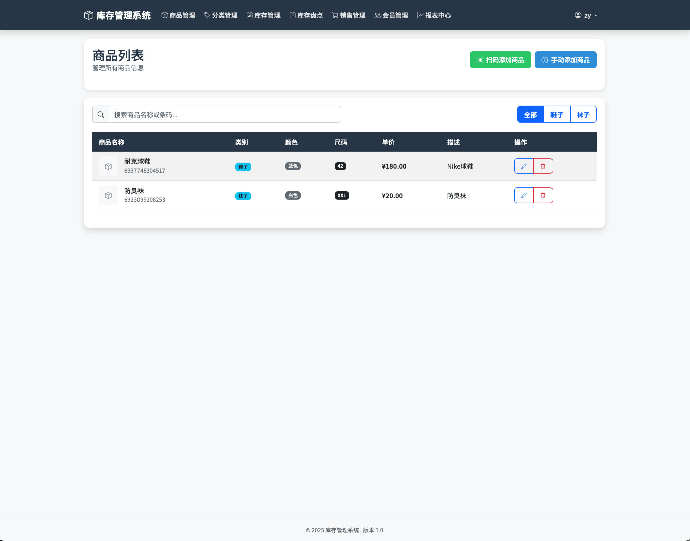

<div align="center">
  
# 📦 IOE 库存管理系统

[](https://www.djangoproject.com/)
[](https://www.python.org/)
[](https://opensource.org/licenses/MIT)

_一站式零售库存解决方案，为您的商店量身定制_

</div>

## 🚀 项目概述

IOE是一个基于Django开发的**综合性库存管理系统**，专为零售商店、小型仓库和商品销售场所设计。系统提供了完整的商品管理、库存跟踪、销售记录、会员管理和数据分析功能，帮助企业高效管理库存和销售流程。

<div align="center">
  

</div>

## ✨ 主要功能模块

### 🏷️ 商品管理

- **商品信息管理**：添加、编辑和查看商品详细信息，包括名称、条码、价格等
- **商品分类管理**：创建和管理商品分类，便于组织和查询
- **商品规格管理**：设置商品的颜色、尺码、规格和制造商等属性
- **商品图片上传**：上传和管理商品图片

### 📊 库存管理

- **实时库存跟踪**：精确掌握每个商品的库存数量
- **智能库存预警**：设置阈值，低库存自动提醒
- **入库/出库管理**：系统自动更新库存数量
- **库存调整**：支持手动调整和批量操作
- **全面交易记录**：详细记录所有库存变动明细

### 📝 库存盘点

- **盘点计划创建**：周期性或临时库存盘点安排
- **高效盘点执行**：记录实际与系统差异
- **盘点审核流程**：确保盘点数据准确性
- **详细盘点报告**：生成可视化盘点差异报告
- **自动库存调整**：根据盘点结果一键调整

### 💰 销售管理

- **销售单创建**：直观便捷的销售操作界面
- **多元支付方式**：现金、微信、支付宝、银行卡和账户余额等
- **灵活销售折扣**：支持多种折扣策略
- **销售记录查询**：多维度筛选历史销售数据
- **无忧退货处理**：简化销售退货流程

### 👥 会员管理

- **会员信息管理**：全面记录会员基础资料
- **会员等级体系**：自定义等级和专属优惠
- **积分奖励系统**：消费自动累积积分
- **消费历史追踪**：会员消费行为分析
- **账户余额管理**：充值与消费一体化
- **贴心生日提醒**：增强会员关怀

### 📊 数据分析与报表

- **销售趋势图表**：直观展示业务走向
- **商品表现分析**：识别热销与滞销商品
- **库存健康评估**：优化库存投资回报
- **利润精准计算**：多维度利润分析
- **会员价值评估**：深入了解会员贡献
- **系统使用审计**：全面操作日志记录

## 🛠️ 技术架构



## 💡 系统特点

| 特点 | 描述 |
|------|------|
| 📱 用户友好 | 简洁直观的界面设计，易于上手和使用 |
| 🔄 功能完善 | 覆盖零售业务全流程，从商品入库到销售、会员管理 |
| 📊 数据可视化 | 丰富的报表和图表，直观展示业务数据 |
| 🔒 安全可靠 | 完善的权限控制和操作日志，保障数据安全 |
| 🔌 灵活扩展 | 模块化设计，易于扩展新功能 |

## 🚀 快速开始

### 安装依赖

```bash
pip install -r requirements.txt
```

### 初始化数据库

```bash
python manage.py migrate
```

### 创建管理员账户

```bash
python manage.py createsuperuser
```

### 启动服务

```bash
python manage.py runserver
```

### 访问系统

在浏览器中访问 [http://127.0.0.1:8000/](http://127.0.0.1:8000/) 即可使用系统

## 📸 系统截图

<div align="center">
  
  
  
  
  
  
  
  
</div>

## 📄 许可证

本项目采用 MIT 许可证

## 📞 联系我们

如有问题或建议，欢迎通过以下方式联系：

- 项目问题: [提交Issue](https://github.com/zhtyyx/ioe/issues)
- 邮箱: zhtyyx@gmail.com

---

<div align="center">
  
  **IOE库存管理系统** ❤️ **让库存管理更简单**
  
</div>