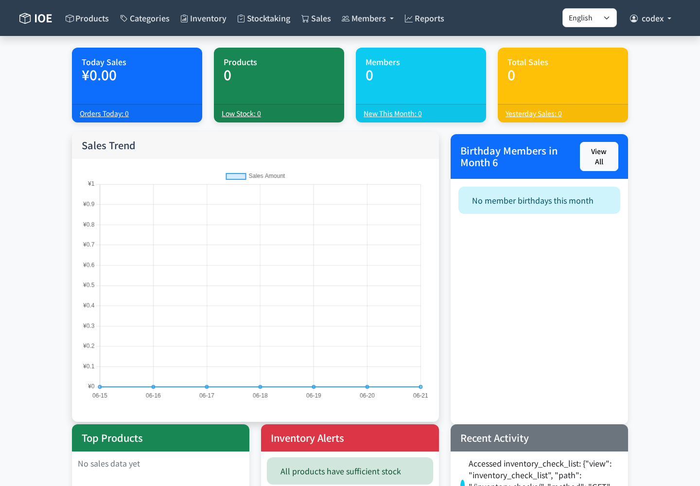
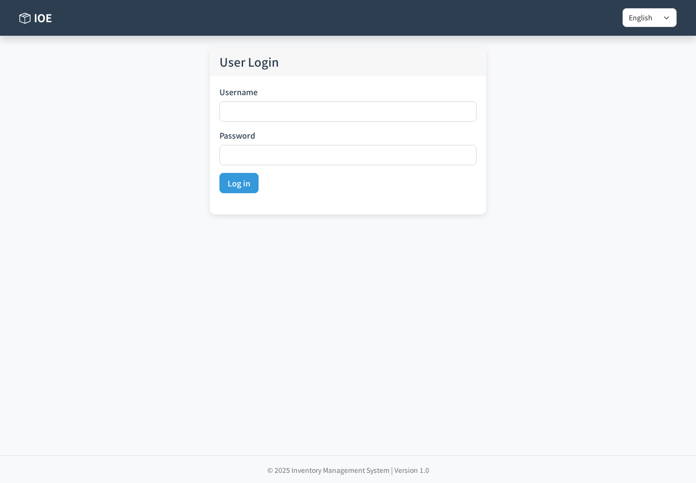
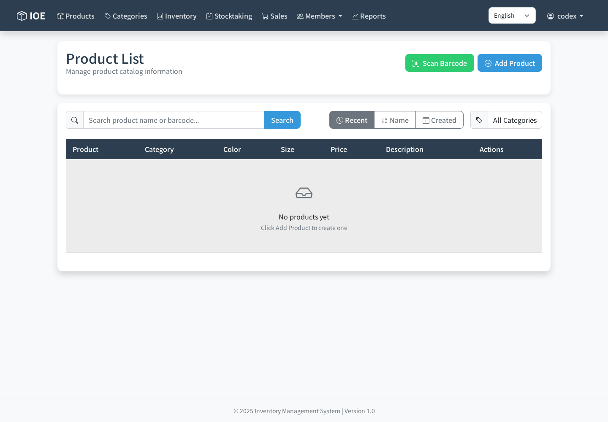
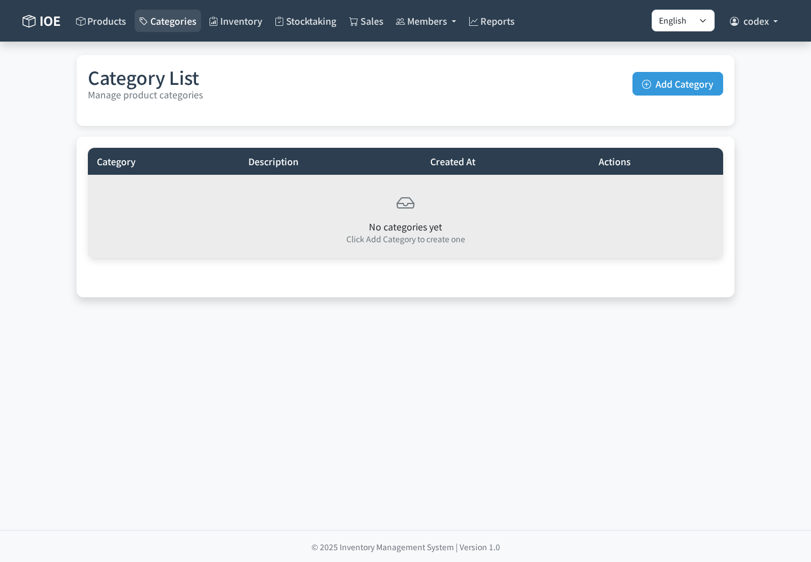
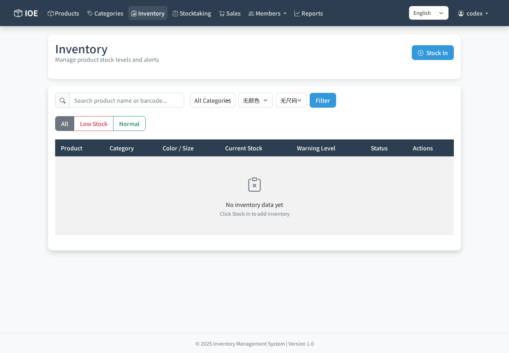
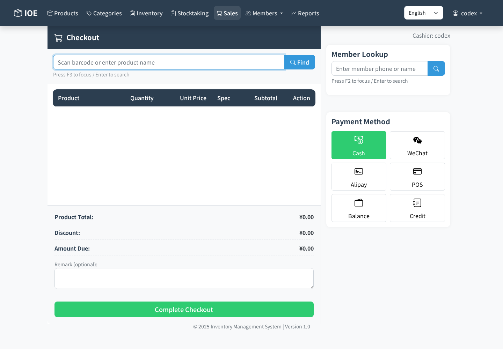
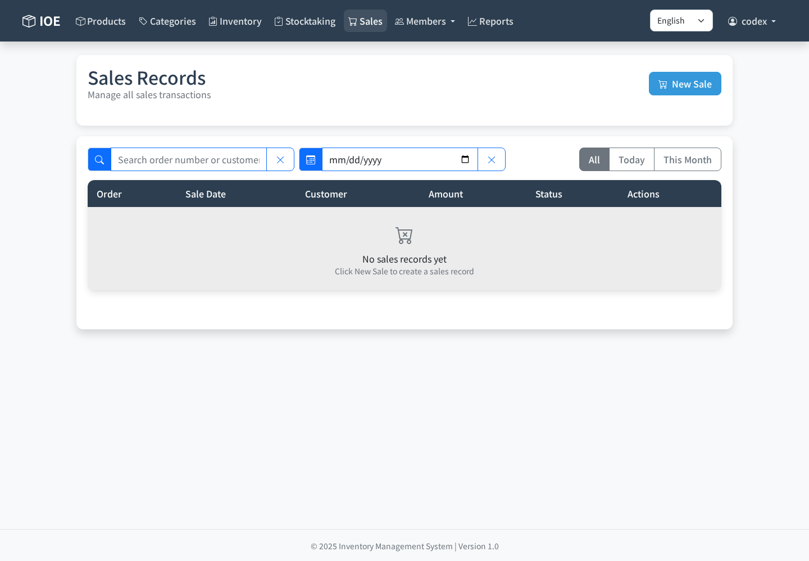
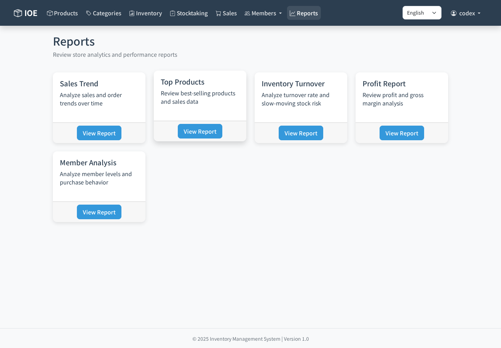
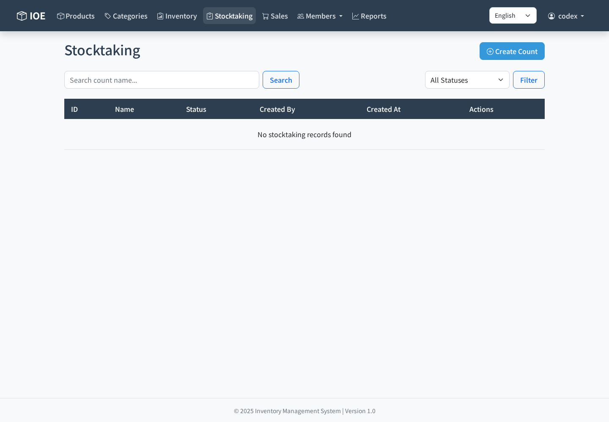

<div align="center">

# IOE Inventory Management System

**A practical Django system for retail inventory, sales checkout, members, reports, and store operations.**

<p>
  <b>English</b> | <a href="README_zh.md">简体中文</a>
</p>

<p>
  <a href="https://www.djangoproject.com/"></a>
  <a href="https://www.python.org/"></a>
  <a href="README.docker_en.md"></a>
  <a href="LICENSE"></a>
</p>

<p>
  <a href="https://github.com/zhtyyx/ioe/stargazers"></a>
  <a href="https://github.com/zhtyyx/ioe/fork"></a>
  <a href="https://github.com/zhtyyx/ioe/issues"></a>
</p>

<p>
  <a href="#quick-start"><b>Quick Start</b></a> ·
  <a href="#screenshots"><b>Screenshots</b></a> ·
  <a href="#star-history"><b>Star History</b></a> ·
  <a href="README.docker_en.md"><b>Docker Guide</b></a>
</p>



<br/>
<p>📧 <b>zhtyyx@gmail.com</b></p>
<p>📱 <b>WeChat</b></p>


</div>

## Why IOE

IOE is built for real store workflows, not just database CRUD. It connects product catalog management, stock movement, sales checkout, member balance, points, inventory counting, reports, operation logs, and backup tools in one Django application.

Use it when you need a self-hosted system for:

- retail stores that need product, inventory, and cashier workflows in one place
- small warehouses that need stock movement and inventory counting
- shops that use member levels, points, recharge, and account balance
- teams that want a Django codebase they can customize and deploy themselves

## Highlights

<table>
  <tr>
    <td><b>Product Catalog</b></td>
    <td>Products, categories, barcode lookup, images, specifications, manufacturers, and pricing.</td>
  </tr>
  <tr>
    <td><b>Inventory Control</b></td>
    <td>Inbound, outbound, adjustment, low-stock warning, transaction records, and inventory counting.</td>
  </tr>
  <tr>
    <td><b>Sales Checkout</b></td>
    <td>Sales orders, payment methods, member discounts, account balance, points, cancellation, and returns.</td>
  </tr>
  <tr>
    <td><b>Member Operations</b></td>
    <td>Member profiles, levels, birthday reminders, recharge records, balance, points, and spending history.</td>
  </tr>
  <tr>
    <td><b>Reports and Admin</b></td>
    <td>Sales trends, product performance, inventory health, profit reports, operation logs, and backup tools.</td>
  </tr>
</table>

## Screenshots

<div align="center">
  <br/><br/>
  <br/><br/>
  <br/><br/>
  <br/><br/>
  <br/><br/>
  <br/><br/>
  <br/><br/>
  <br/><br/>
  <br/><br/>
</div>

## Quick Start

### 1. Install Dependencies

```bash
pip install -r requirements.txt
```

### 2. Initialize the Database

IOE uses SQLite by default, so it can run locally without a separate database service.

```bash
python manage.py migrate
```

For production, you can switch `DATABASES` in `inventory/settings.py` to PostgreSQL. The project already includes the `psycopg2` dependency.

### 3. Create an Admin Account

```bash
python manage.py createsuperuser
```

### 4. Start the Development Server

```bash
python manage.py runserver
```

Open [http://127.0.0.1:8000/](http://127.0.0.1:8000/) in your browser.

## Docker Deployment

- [Docker Deployment Guide](README.docker_en.md)
- [Docker 部署指南](README.docker_zh.md)

## Star History

<div align="center">
  <a href="https://star-history.com/#zhtyyx/ioe&Date">
    <picture>
      <source media="(prefers-color-scheme: dark)" srcset="https://api.star-history.com/svg?repos=zhtyyx/ioe&type=Date&theme=dark" />
      <source media="(prefers-color-scheme: light)" srcset="https://api.star-history.com/svg?repos=zhtyyx/ioe&type=Date" />
      
    </picture>
  </a>
</div>

## Project Structure

```text
.
├── inventory/        # Main Django app
├── project/          # Django project configuration
├── asset/            # Screenshots and README assets
├── requirements.txt  # Python dependencies
├── Dockerfile
├── docker-compose.yml
└── manage.py
```

## Contributing

Contributions are welcome. To keep the project stable, please prefer focused pull requests:

- one bug fix per PR
- one feature area per PR
- tests for inventory, sales, balance, or backup changes
- screenshots for UI-facing changes

For large changes, open an issue first so the scope can be discussed before implementation.

## Support

If this project is useful to you, you can support continued development:

<div align="center">
   &nbsp;&nbsp;&nbsp; 
</div>

## Contact

- Issues: [GitHub Issues](https://github.com/zhtyyx/ioe/issues)
- Email: [zhtyyx@gmail.com](mailto:zhtyyx@gmail.com)

## License

This project is licensed under the [MIT License](LICENSE).

---

<div align="center">
  Software copyright has been registered. If you have questions, please contact the project maintainer.<br/>
  Copyright (c) 2025-2026 IOE Team. All rights reserved.
</div>
