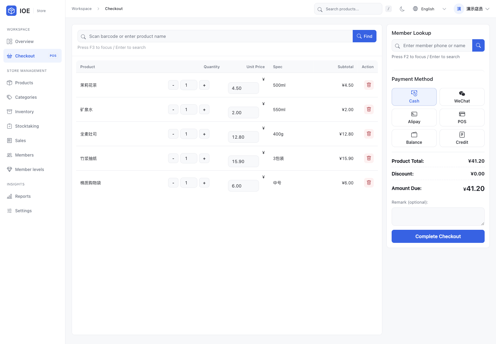
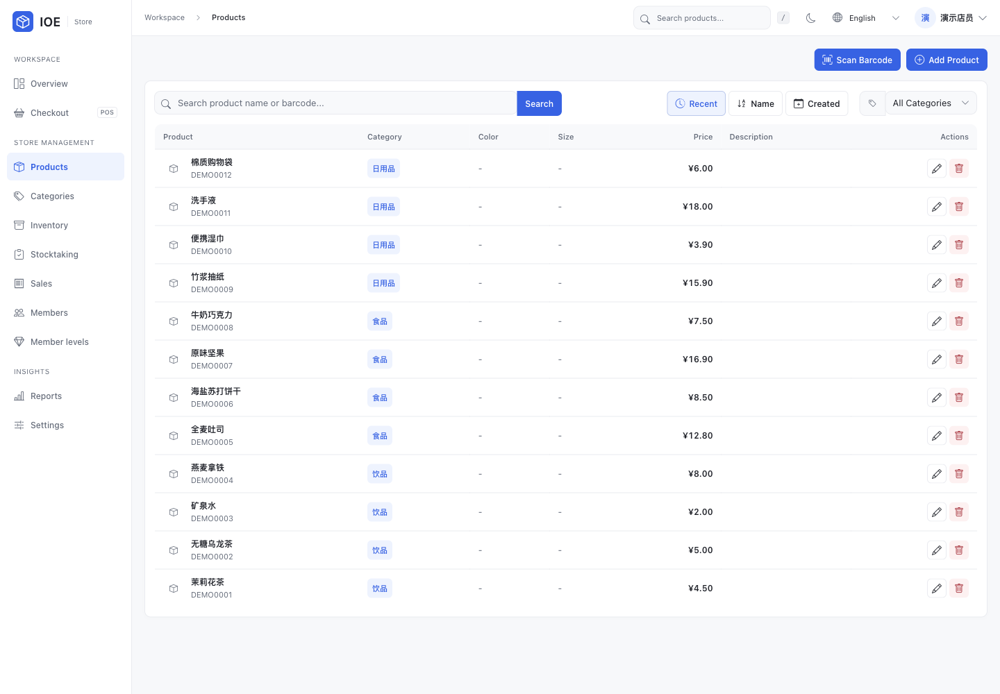
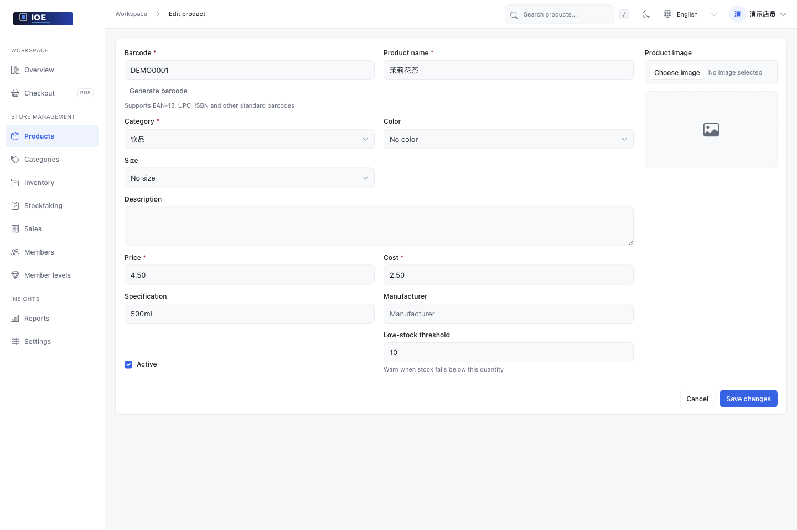
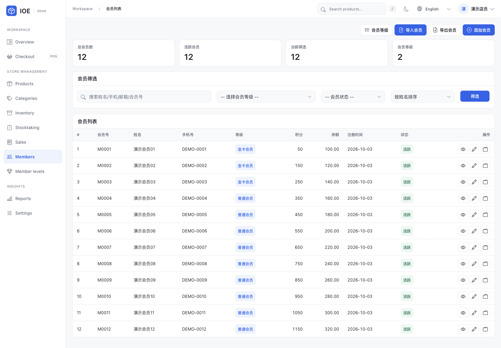
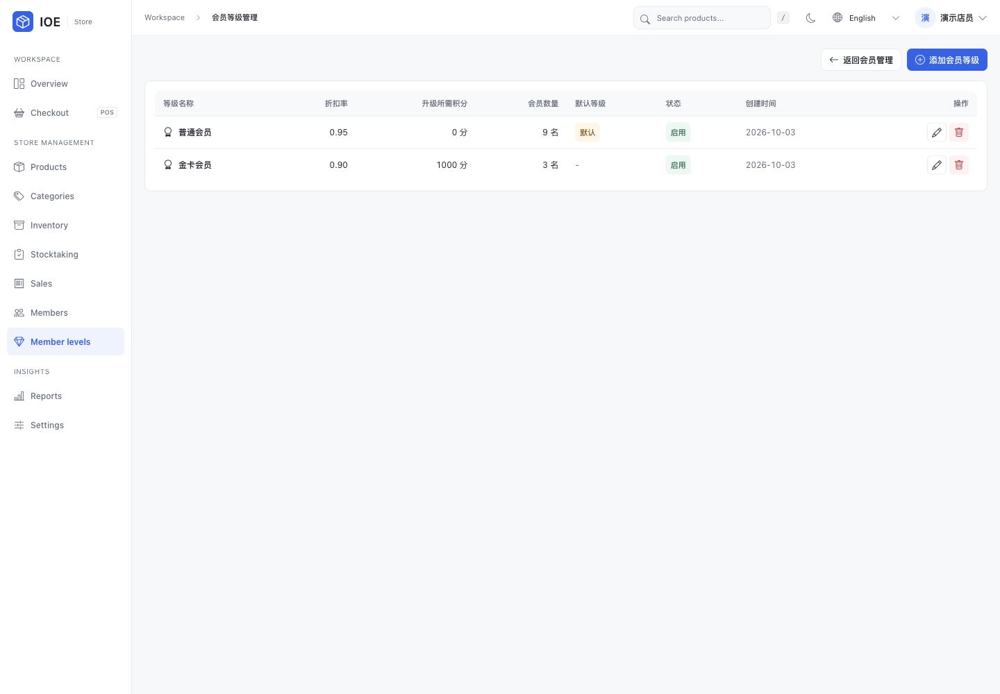
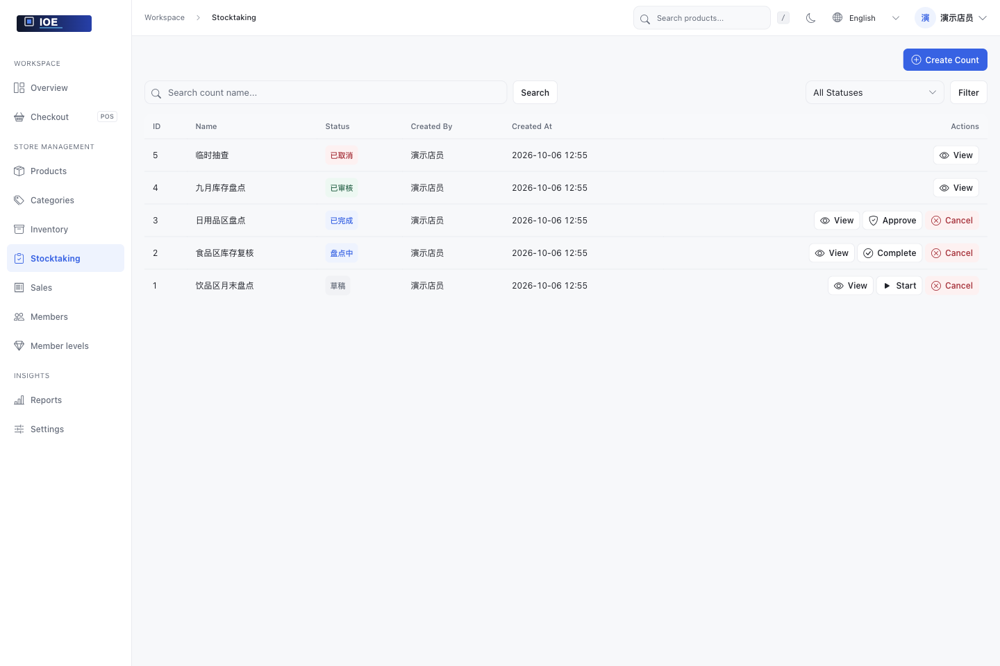

<div align="center">

# IOE Inventory Management System

**Keep stock, sales, and member records together—from receiving goods to checkout.**

[简体中文](README_zh.md) · [Quick start](#quick-start) · [Interface preview](#interface-preview) · [Contact](#contact)

</div>

IOE is an open-source management system for small retail stores. Maintain a product catalog, record stock movements, scan items at checkout, manage member balances and points, and review sales and inventory reports. Built with Django and SQLite by default, it can run locally or on your own server and can be adapted to your store's workflows.

### Start with your store's numbers

Review revenue, profit, and order counts by date, with daily details alongside the chart. All screenshots below use local demo data.


## What you can do

| Workflow | Features |
| --- | --- |
| Products and barcodes | Maintain categories, prices, costs, specifications, and images; look up products by barcode. |
| Stock and stocktaking | Record receipts, withdrawals, and adjustments; review low-stock alerts and movements; reconcile physical counts. |
| Checkout | Scan or search for products, adjust quantities, apply member discounts, and record payment methods and sale items. |
| Member accounts | Manage membership levels, recharges, balances, points, purchase history, and birthday reminders. |
| Reports and administration | Review sales trends and inventory turnover; manage user permissions, operation logs, and backups. |

These workflows share the same product, inventory, and member records. Received stock is available at checkout; sales produce order and stock movement records that can be reviewed later. The interface offers Chinese and English language switching and light and dark themes.

## Interface preview

### Inventory turnover: see how stock is moving

Compare stock levels, units sold, and days in inventory to inform replenishment decisions and identify slow-moving products.


### Checkout: items, payment, and totals in one view

Review the cart, find a member, and choose a payment method on the same page. Add products by barcode or name.



<details>
<summary><strong>Business overview and report navigation</strong></summary>

The overview brings together today's sales, product and member counts, stock alerts, and recent sales trends.


The report center provides access to sales, product, inventory, and member analysis.


</details>

<details>
<summary><strong>Product catalog and inventory</strong></summary>

Search and filter products, then edit prices, specifications, images, and stock warning thresholds.





The inventory list shows quantities and warning states, with actions for stock receipts, withdrawals, and adjustments.


</details>

<details>
<summary><strong>Members and stocktaking</strong></summary>

Review member profiles, balances, and points, and configure discounts by membership level.





Track stocktaking tasks through counting, completion, and approval, and reconcile recorded stock with physical counts.



</details>

## Quick start

Use Python 3.10 or newer. The commands below are for macOS / Linux. SQLite is the default, so no separate database server is needed.

1. Clone the project and create a virtual environment:

   ```bash
   git clone https://github.com/zhtyyx/ioe.git
   cd ioe
   python3 -m venv .venv
   source .venv/bin/activate
   ```

2. Install dependencies, initialize the database, and create a login account:

   ```bash
   python -m pip install -r requirements.txt
   python -c "from pathlib import Path; Path('db').mkdir(exist_ok=True)"
   python manage.py migrate
   python manage.py createsuperuser
   ```

3. Start the local server:

   ```bash
   python manage.py runserver
   ```

Open <http://127.0.0.1:8000/> and sign in with the account you just created. A new installation starts with an empty database; the demo data shown here is not imported automatically.

On Windows, use `python` in place of `python3` and activate the virtual environment with `.venv\Scripts\activate`.

The database is stored in `db/db.sqlite3`, and uploaded files are stored in `media/`. Use `runserver` for local development. For containers, persistent storage, and deployment considerations, see the [Docker guide](README.docker_en.md).

## Development and tests

Run the full test suite:

```bash
python manage.py test --settings=inventory.test_settings
```

This configuration uses a separate temporary database and file directories. Tests cover checkout, member balances, stock movements, concurrent withdrawals, and backup restoration.

Application code lives in `inventory/`: `models/` defines data structures, `views/` and `services/` handle business logic, `templates/` and `static/` provide the interface, and `tests/` contains the test suite. Documentation screenshots live in `asset/`.

Use [Issues](https://github.com/zhtyyx/ioe/issues) to report bugs or propose features. Pull requests should describe the trigger, expected behavior, and validation. Include tests for business changes and screenshots for interface changes. Discuss the use case and scope before starting a large feature.

## Contact

- Email: [zhtyyx@gmail.com](mailto:zhtyyx@gmail.com)
- Bug reports: [GitHub Issues](https://github.com/zhtyyx/ioe/issues)
- WeChat: scan the QR code below to connect.

<div align="center">
  
</div>

## Support the project

If IOE is useful to you, consider sharing feedback, contributing an improvement, or supporting continued maintenance.

<div align="center">
  
  
</div>

## License

IOE is available under the [MIT License](LICENSE). You may use, modify, and distribute it under the license terms.
