<div align="center">

# 📦 IOE Inventory Management System

[](https://www.djangoproject.com/) &nbsp; [](https://www.python.org/) &nbsp; [](https://opensource.org/licenses/MIT)

_All-in-one retail inventory solution, tailored for your store_

</div>

## 🚀 Project Overview

IOE is a **comprehensive inventory management system** developed with Django, specifically designed for retail stores, small warehouses, and merchandise sales locations. The system provides complete product management, inventory tracking, sales recording, membership management, and data analysis functions to help businesses efficiently manage inventory and sales processes.

<!-- Content separator -->

## ✨ Main Functional Modules

### 🏷️ Product Management

- **Product Information Management**: Add, edit, and view detailed product information, including name, barcode, price, etc.
- **Product Category Management**: Create and manage product categories for easy organization and querying
- **Product Specification Management**: Set product attributes such as color, size, specifications, and manufacturer
- **Product Image Upload**: Upload and manage product images

### 📊 Inventory Management

- **Real-time Inventory Tracking**: Precisely track the inventory quantity of each product
- **Smart Inventory Alerts**: Set thresholds for automatic low inventory reminders
- **Inbound/Outbound Management**: System automatically updates inventory quantities
- **Inventory Adjustment**: Support manual adjustments and batch operations
- **Comprehensive Transaction Records**: Detailed recording of all inventory changes

### 📝 Inventory Counting

- **Count Plan Creation**: Periodic or temporary inventory count arrangements
- **Efficient Count Execution**: Record actual vs. system differences
- **Count Verification Process**: Ensure accuracy of count data
- **Detailed Count Reports**: Generate visualized count difference reports
- **Automatic Inventory Adjustment**: One-click adjustment based on count results

### 💰 Sales Management

- **Sales Order Creation**: Intuitive and convenient sales operation interface
- **Multiple Payment Methods**: Cash, WeChat, Alipay, bank cards, and account balance
- **Flexible Sales Discounts**: Support for various discount strategies
- **Sales Record Query**: Multi-dimensional filtering of historical sales data
- **Hassle-free Return Processing**: Simplified sales return process

### 👥 Membership Management

- **Member Information Management**: Comprehensive recording of member basic information
- **Membership Level System**: Customizable levels and exclusive benefits
- **Points Reward System**: Automatic point accumulation with purchases
- **Consumption History Tracking**: Analysis of member consumption behavior
- **Account Balance Management**: Integrated recharge and consumption
- **Birthday Reminders**: Enhanced member care

### 📊 Data Analysis and Reports

- **Sales Trend Charts**: Visual display of business trends
- **Product Performance Analysis**: Identify hot-selling and slow-moving products
- **Inventory Health Assessment**: Optimize inventory return on investment
- **Precise Profit Calculation**: Multi-dimensional profit analysis
- **Member Value Assessment**: In-depth understanding of member contributions
- **System Usage Audit**: Comprehensive operation log recording

## 💡 System Features

| Feature | Description |
|------|------|
| 📱 User-Friendly | Clean and intuitive interface design, easy to learn and use |
| 🔄 Comprehensive | Covers the entire retail business process, from product warehousing to sales and membership management |
| 📊 Data Visualization | Rich reports and charts, visually displaying business data |
| 🔒 Secure and Reliable | Complete permission control and operation logs, ensuring data security |
| 🔌 Flexible Extension | Modular design, easy to extend new features |

## 🚀 Quick Start

### Install Dependencies

```bash
pip install -r requirements.txt
```

### Create Database, Configure in settings.py, Initialize Database

```bash
python manage.py migrate
```

### Create Admin Account

```bash
python manage.py createsuperuser
```

### Start Service

```bash
python manage.py runserver
```

### Access the System

Visit [http://127.0.0.1:8000/](http://127.0.0.1:8000/) in your browser to use the system

### Docker Deployment

For Docker deployment instructions, please refer to [Docker Deployment Guide](README.docker.md)

## 📸 System Screenshots

<div align="center">
  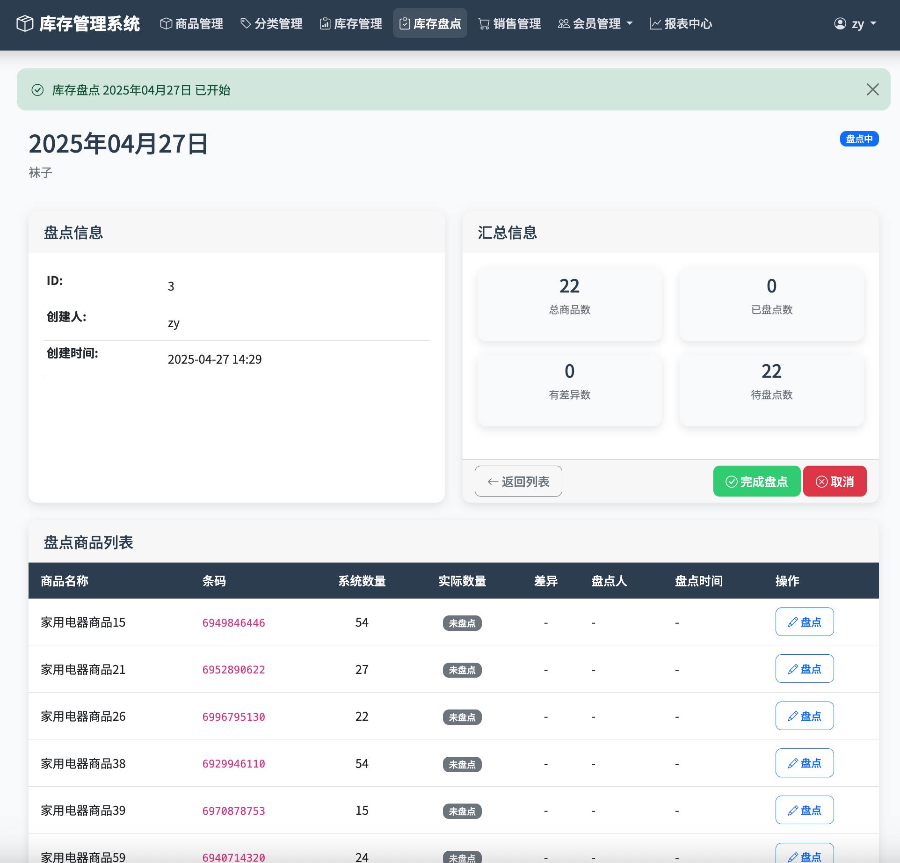<br/><br/>
  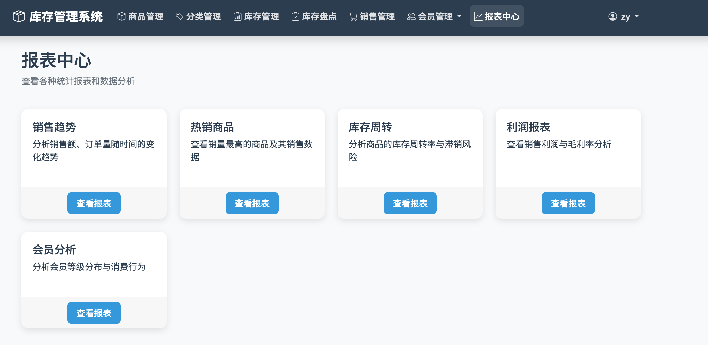<br/><br/>
  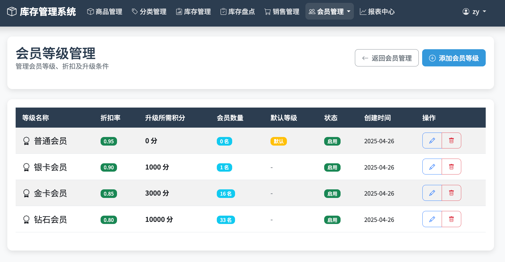<br/><br/>
  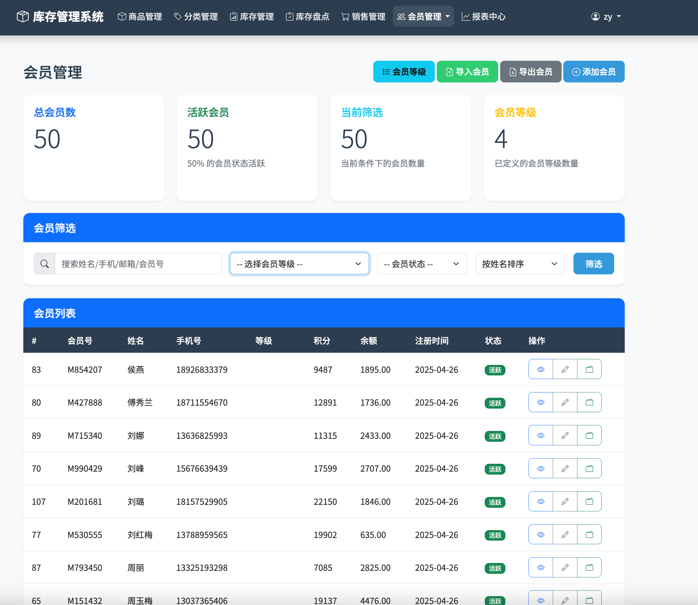<br/><br/>
  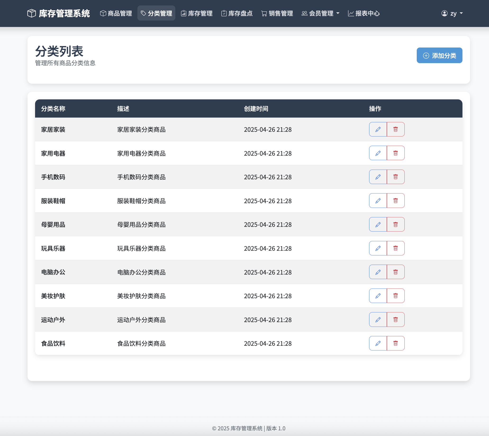<br/><br/>
  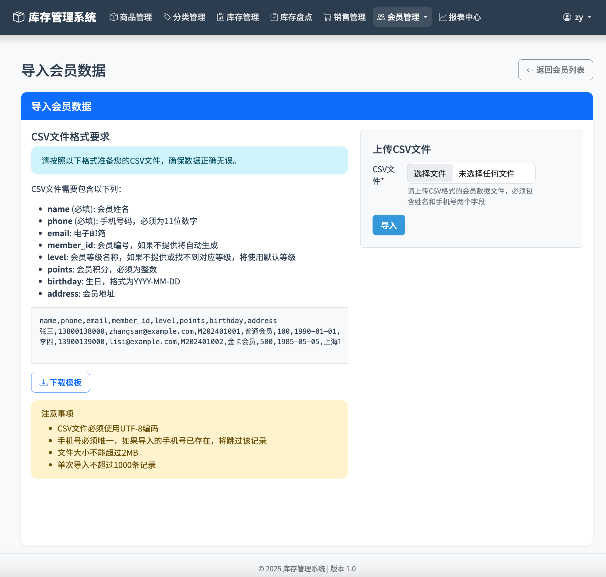<br/><br/>
  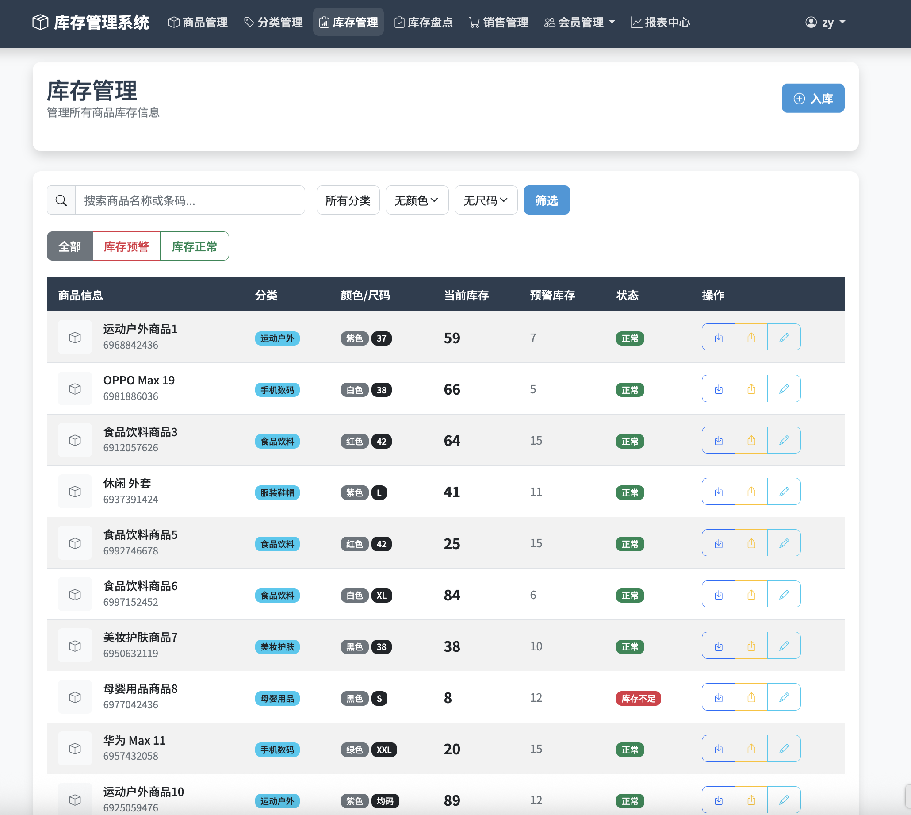<br/><br/>
  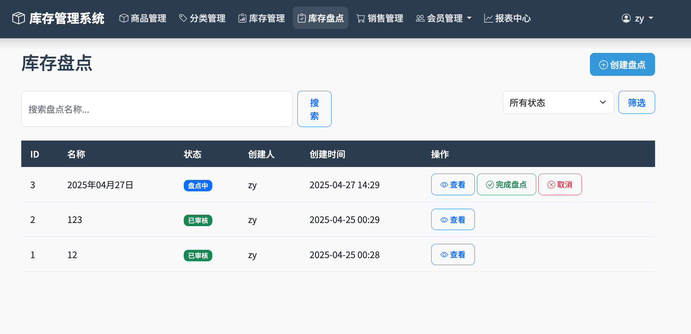<br/><br/>
  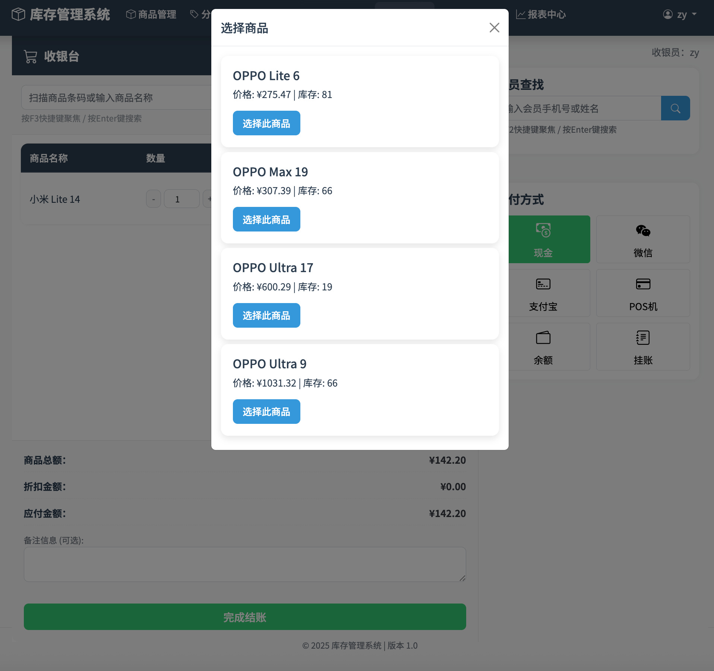<br/><br/>
  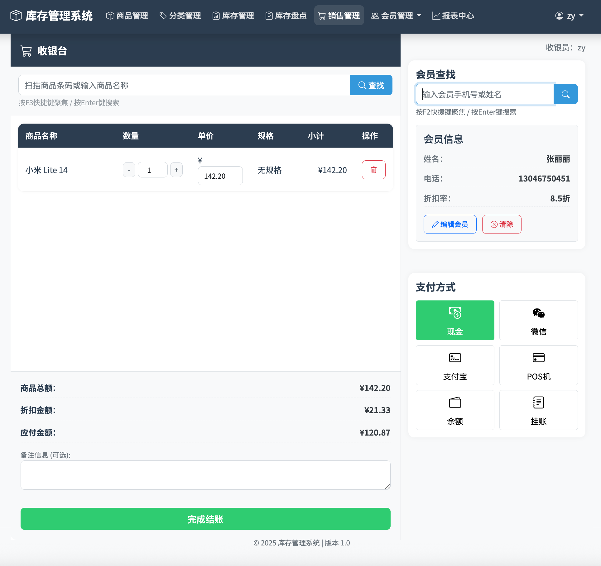<br/><br/>
  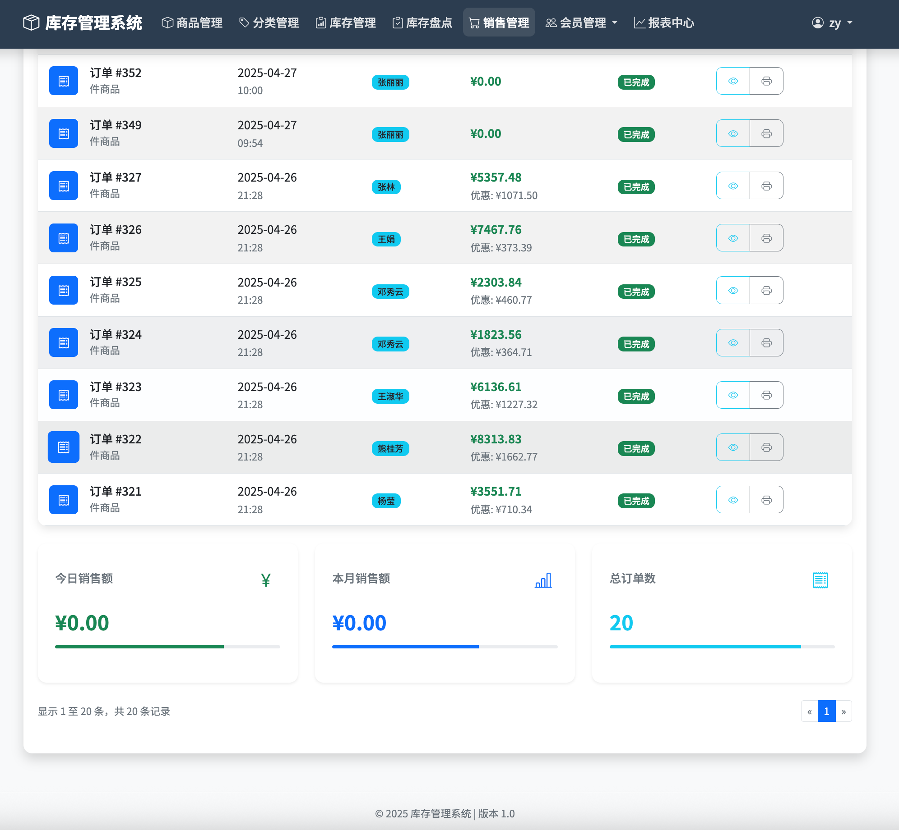<br/><br/>
  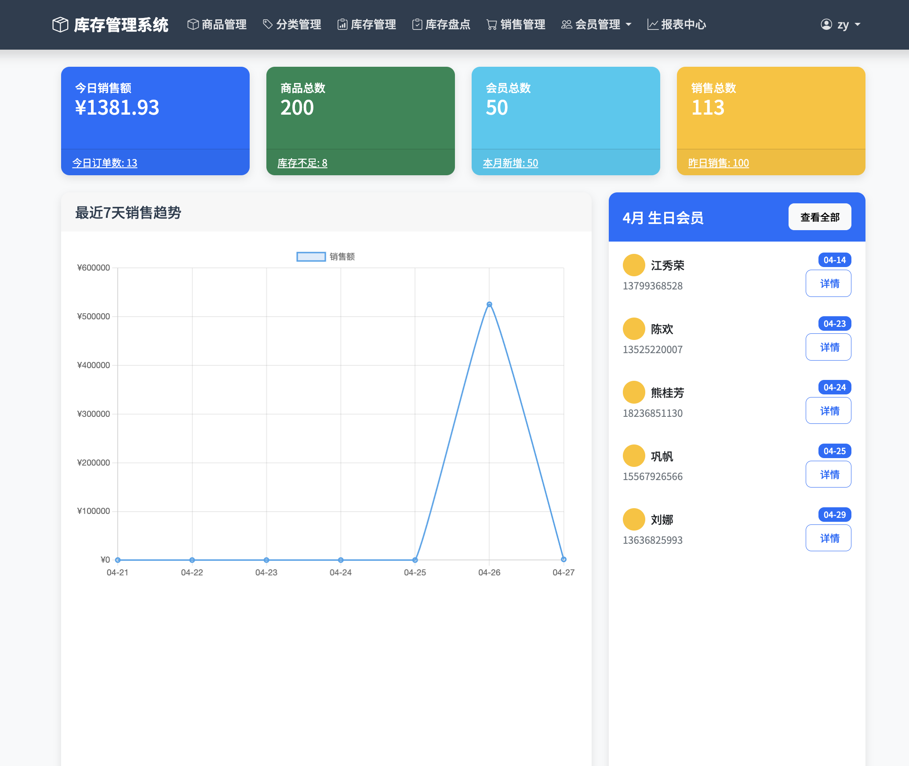<br/><br/>

</div>

## 📄 License

This project is licensed under the MIT License

## ☕ Buy Me a Coffee
If you find this project helpful, you can support me through the following methods:

<div align="center">
   &nbsp;&nbsp;&nbsp; 
</div>


## 📞 Contact Us

For questions, suggestions, or customization needs, please contact us through the following channels:

- Project Issues: [Submit Issue](https://github.com/zhtyyx/ioe/issues)
- Email: zhtyyx@gmail.com

---

<div align="center">
  Software copyright has been registered. If you have any questions, please contact me.
</div>