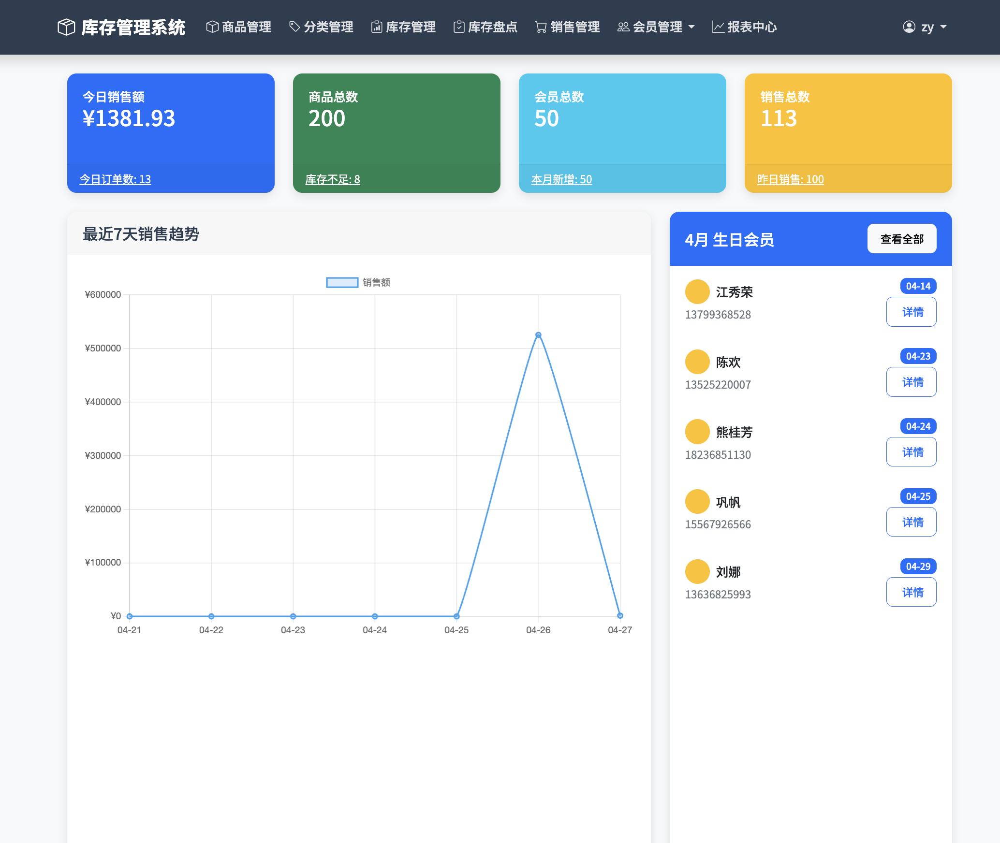
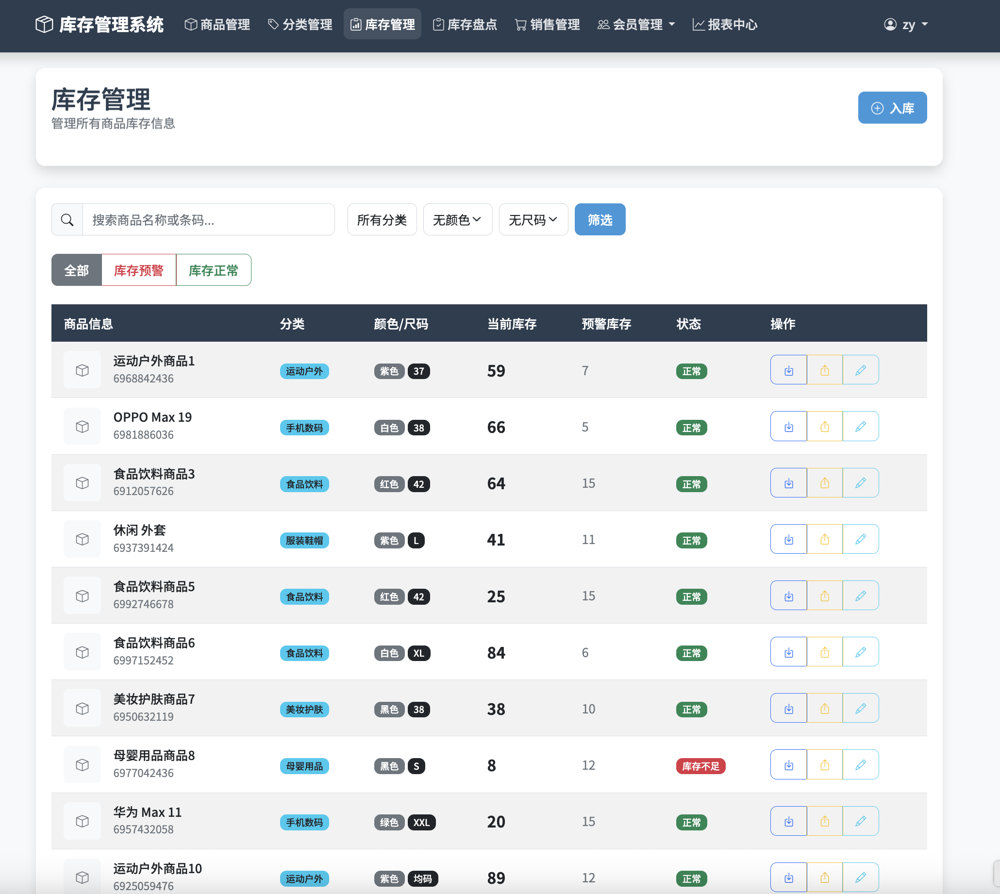
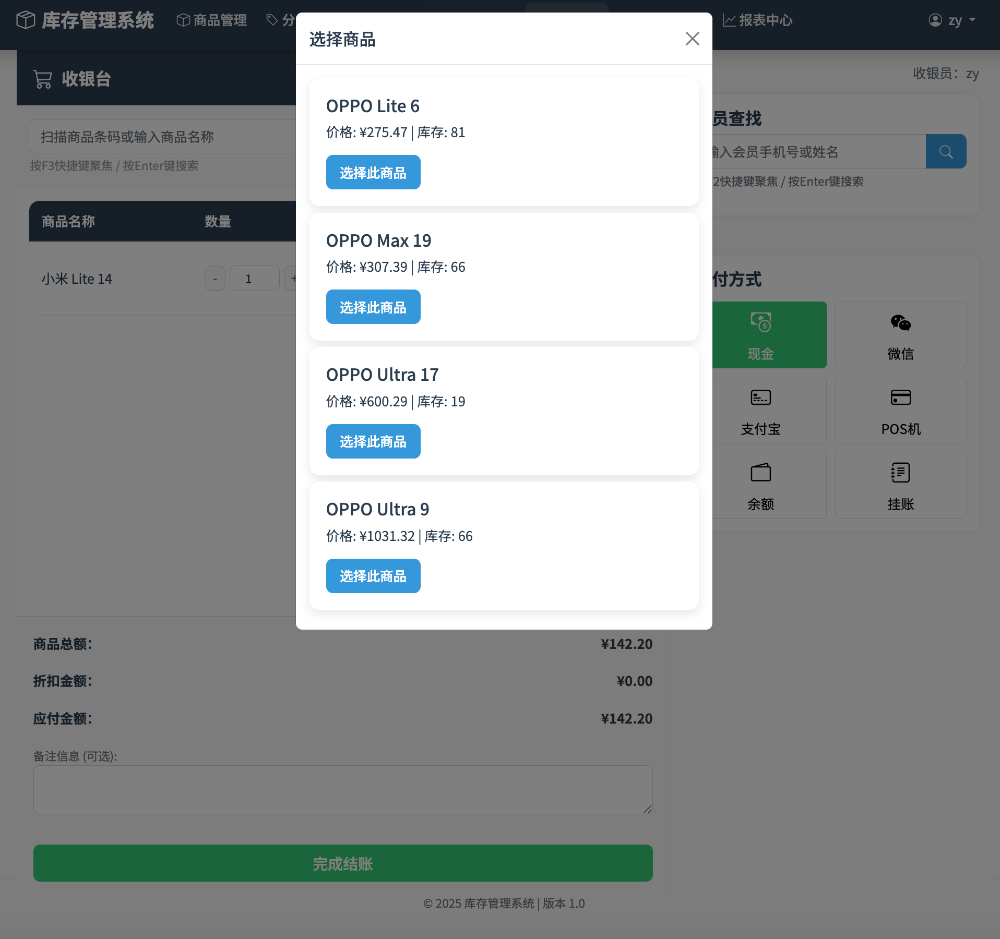
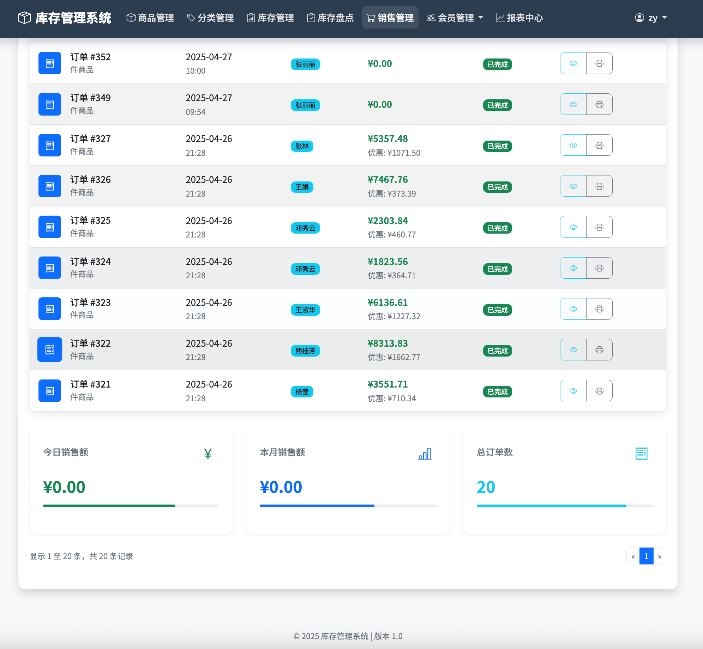
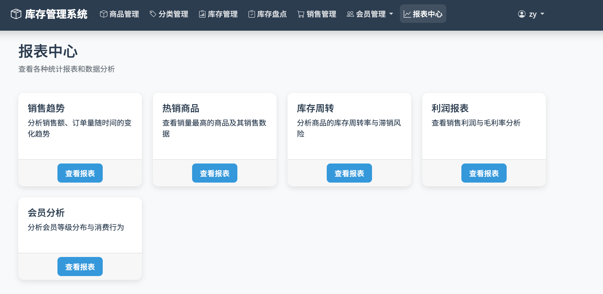
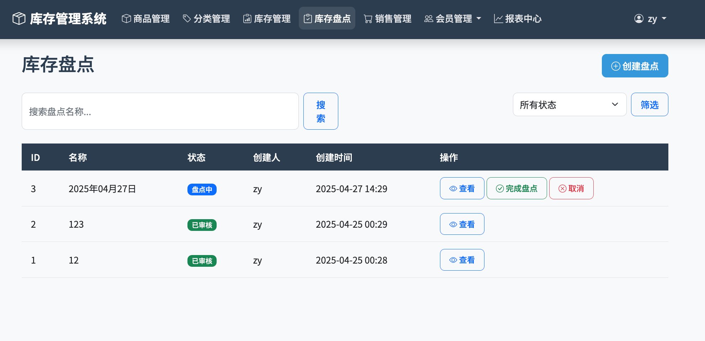

<div align="center">

# IOE 库存管理系统

**面向零售门店、小型仓库和销售场景的 Django 库存、收银、会员与报表系统。**

<p>
  <a href="README.md">English</a> | <b>简体中文</b>
</p>

<p>
  <a href="https://www.djangoproject.com/"></a>
  <a href="https://www.python.org/"></a>
  <a href="README.docker_zh.md"></a>
  <a href="LICENSE"></a>
</p>

<p>
  <a href="https://github.com/zhtyyx/ioe/stargazers"></a>
  <a href="https://github.com/zhtyyx/ioe/fork"></a>
  <a href="https://github.com/zhtyyx/ioe/issues"></a>
</p>

<p>
  <a href="#快速开始"><b>快速开始</b></a> ·
  <a href="#系统截图"><b>系统截图</b></a> ·
  <a href="#star-趋势"><b>Star 趋势</b></a> ·
  <a href="README.docker_zh.md"><b>Docker 部署</b></a>
</p>



</div>

## 为什么选择 IOE

IOE 不是单纯的商品表 CRUD，而是围绕真实门店流程设计的一套库存管理系统。它把商品资料、库存变动、收银销售、会员余额、积分、库存盘点、经营报表、操作日志和备份工具放在一个 Django 应用里，便于自部署和二次开发。

适合这些场景：

- 零售门店需要统一管理商品、库存和收银
- 小型仓库需要入库、出库、调整和盘点
- 店铺需要会员等级、积分、充值和余额消费
- 团队希望拥有可定制、可私有部署的 Django 代码库

<div align="center">
  <p>📧 <b>zhtyyx@gmail.com</b> &nbsp;&nbsp;|&nbsp;&nbsp; 📱 <b>微信</b></p>
  
</div>

## 核心能力

<table>
  <tr>
    <td><b>商品资料</b></td>
    <td>商品、分类、条码、图片、规格、制造商和价格管理。</td>
  </tr>
  <tr>
    <td><b>库存控制</b></td>
    <td>入库、出库、调整、低库存预警、库存流水和库存盘点。</td>
  </tr>
  <tr>
    <td><b>销售收银</b></td>
    <td>销售单、支付方式、会员折扣、余额支付、积分、取消和退货流程。</td>
  </tr>
  <tr>
    <td><b>会员运营</b></td>
    <td>会员资料、会员等级、生日提醒、充值记录、余额、积分和消费历史。</td>
  </tr>
  <tr>
    <td><b>报表与系统工具</b></td>
    <td>销售趋势、商品表现、库存健康、利润分析、操作日志和系统备份。</td>
  </tr>
</table>

## 系统截图

<div align="center">
  <br/><br/>
  <br/><br/>
  <br/><br/>
  <br/><br/>
  <br/><br/>
</div>

## 快速开始

### 1. 安装依赖

```bash
pip install -r requirements.txt
```

### 2. 初始化数据库

系统默认使用 SQLite，本地运行无需额外安装数据库服务。

```bash
python manage.py migrate
```

生产环境可以在 `inventory/settings.py` 的 `DATABASES` 中切换到 PostgreSQL。项目已包含 `psycopg2` 依赖。

### 3. 创建管理员账户

```bash
python manage.py createsuperuser
```

### 4. 启动开发服务

```bash
python manage.py runserver
```

然后在浏览器中打开 [http://127.0.0.1:8000/](http://127.0.0.1:8000/)。

## Docker 部署

- [Docker 部署指南](README.docker_zh.md)
- [Docker Deployment Guide](README.docker_en.md)

## Star 趋势

<div align="center">
  <a href="https://star-history.com/#zhtyyx/ioe&Date">
    <picture>
      <source media="(prefers-color-scheme: dark)" srcset="https://api.star-history.com/svg?repos=zhtyyx/ioe&type=Date&theme=dark" />
      <source media="(prefers-color-scheme: light)" srcset="https://api.star-history.com/svg?repos=zhtyyx/ioe&type=Date" />
      
    </picture>
  </a>
</div>

## 项目结构

```text
.
├── inventory/        # 主要 Django 应用
├── project/          # Django 项目配置
├── asset/            # 截图和 README 素材
├── requirements.txt  # Python 依赖
├── Dockerfile
├── docker-compose.yml
└── manage.py
```

## 参与贡献

欢迎提交 issue 和 pull request。为了保持主分支稳定，建议：

- 一个 PR 只修一个问题
- 一个 PR 只做一个功能域
- 涉及库存、销售、余额、备份的改动请补测试
- UI 改动请附截图说明

较大的功能建议先开 issue 讨论范围，再开始实现。

## 支持项目

如果这个项目对你有帮助，可以通过以下方式支持后续维护：

<div align="center">
   &nbsp;&nbsp;&nbsp; 
</div>

## 联系方式

- 问题反馈：[GitHub Issues](https://github.com/zhtyyx/ioe/issues)
- 邮箱：[zhtyyx@gmail.com](mailto:zhtyyx@gmail.com)

## 许可证

本项目采用 [MIT License](LICENSE)。

---

<div align="center">
  软件著作权已登记，如有疑问请联系项目维护者。<br/>
  Copyright (c) 2025-2026 IOE Team. All rights reserved.
</div>
