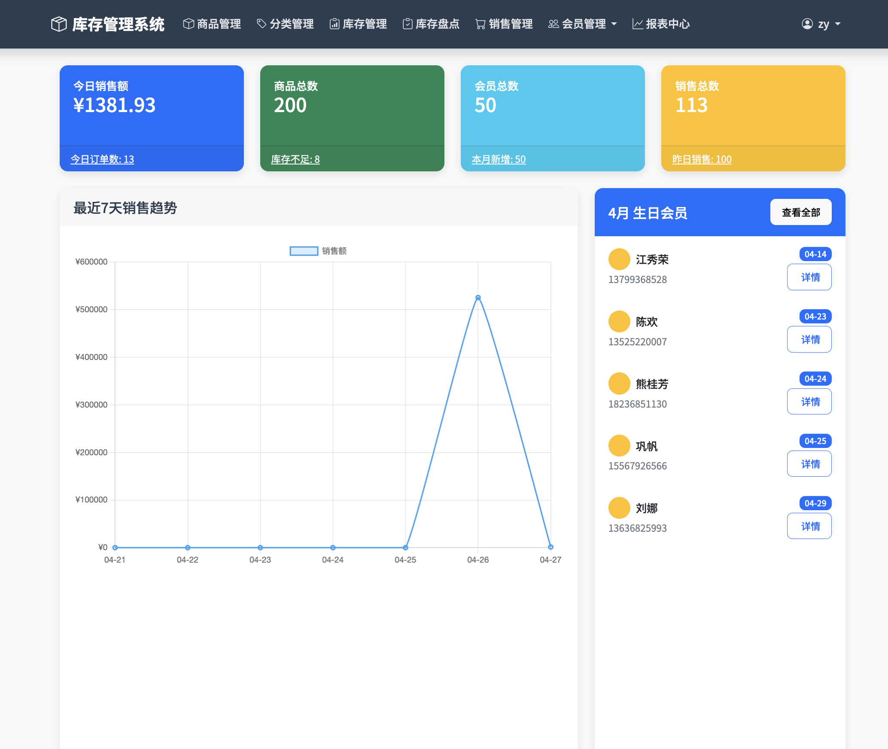
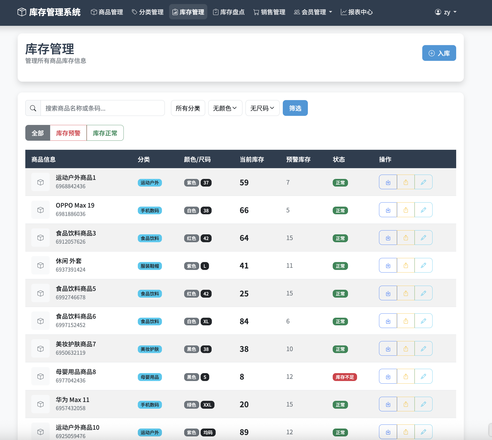
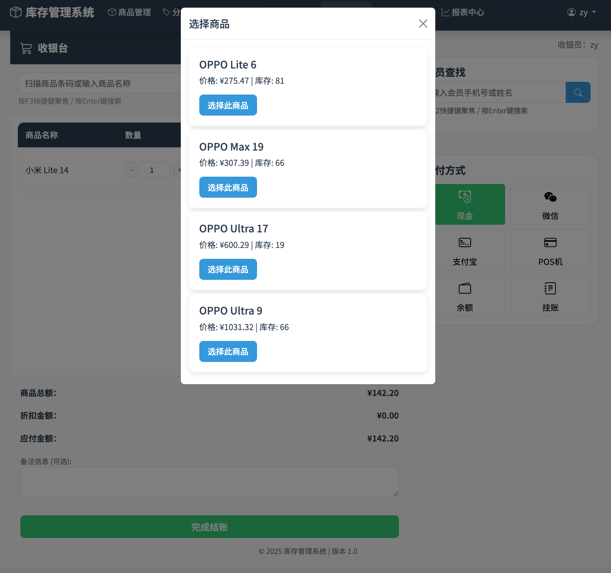
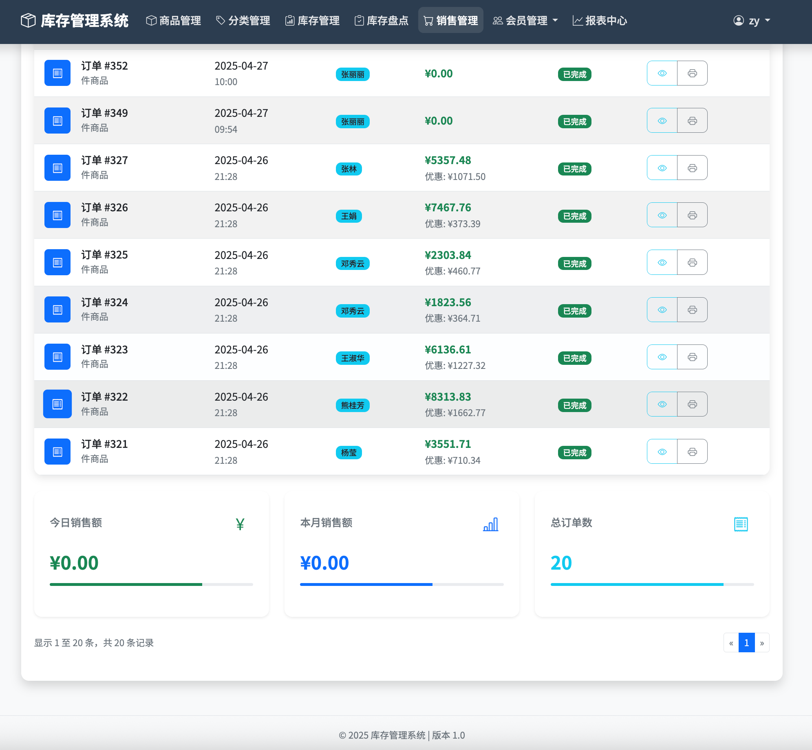

# IOE 库存管理系统

[English](README.md) · [Docker 部署指南](README.docker_zh.md) · [问题反馈](https://github.com/zhtyyx/ioe/issues)

IOE 是面向小型零售门店的 Django 应用，用于管理商品、库存、销售、会员和报表。默认使用 SQLite，本地启动不需要单独安装数据库服务。



## 当前支持的功能

| 模块 | 功能 |
| --- | --- |
| 商品 | 分类、条码、价格、预设颜色与尺码、图片、详情页 |
| 库存 | 入库、出库、调整、低库存提醒、库存流水、盘点 |
| 销售 | 收银、支付方式、会员折扣、余额支付、销售记录 |
| 会员 | 等级、充值、余额与积分管理、生日提醒、会员导入导出 |
| 管理 | 报表、用户权限、操作日志、备份管理 |

[issue #34](https://github.com/zhtyyx/ioe/issues/34) 中的商品批量导入导出、自定义颜色与尺码、已完成订单退货仍待实现。未完成的销售单可以取消，但取消不等于退货或退款。

## 页面截图







## 本地运行

建议使用 Python 3.10 或更高版本；Docker 镜像使用 Python 3.10。

1. 克隆仓库并创建虚拟环境：

   ```bash
   git clone https://github.com/zhtyyx/ioe.git
   cd ioe
   python3 -m venv .venv
   source .venv/bin/activate
   ```

   以上命令适用于 POSIX shell。Windows 用户可用 `.venv\Scripts\activate` 激活环境，并在迁移前创建 `db` 目录。

2. 安装依赖并初始化 SQLite：

   ```bash
   python -m pip install -r requirements.txt
   mkdir -p db
   python manage.py migrate
   python manage.py createsuperuser
   ```

3. 启动开发服务：

   ```bash
   python manage.py runserver
   ```

打开 <http://127.0.0.1:8000/>，使用刚创建的账号登录。数据库文件位于 `db/db.sqlite3`，上传文件位于 `media/`。

`runserver` 仅用于本地开发。容器启动、环境变量和部署限制见 [Docker 部署指南](README.docker_zh.md)。

## 运行测试

```bash
python manage.py test inventory.tests
```

当前测试集有 4 项旧的集成/视图测试失败；排查完整测试结果时，请先核对这些测试的断言。

## 项目结构

```text
inventory/            Django 配置、模型、视图、模板和测试
asset/                文档截图
Dockerfile            容器镜像
docker-compose.yml    本地 Compose 配置
docker-compose.prod.yml  生产配置示例
requirements.txt       Python 依赖
manage.py              Django 管理命令
```

## 参与贡献

发现问题或提出新功能，请创建 [issue](https://github.com/zhtyyx/ioe/issues)。PR 尽量只处理一个主题；修改库存、销售、余额、备份时请附测试，修改页面时请附截图。

项目采用 [MIT License](LICENSE)。
