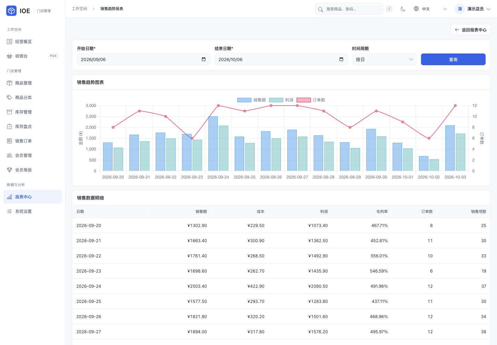
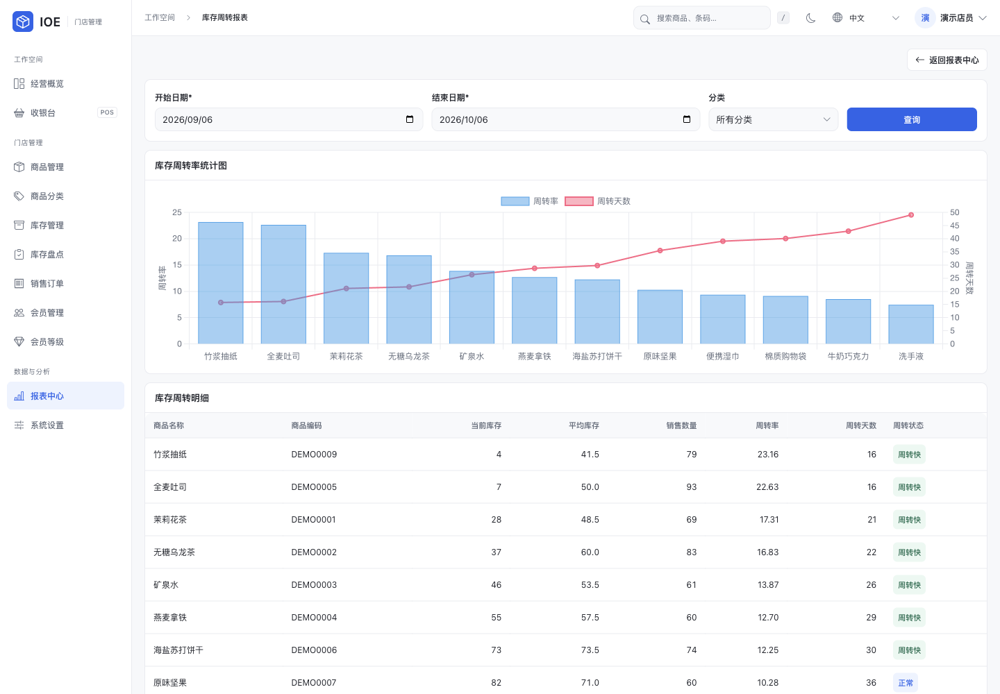
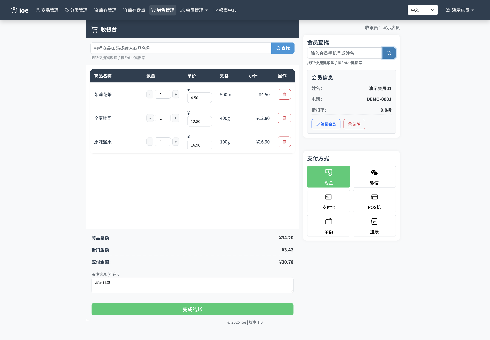
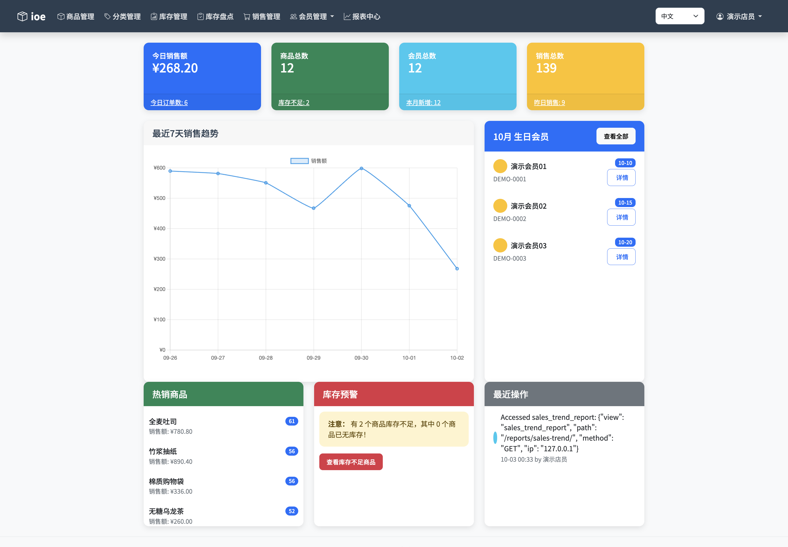
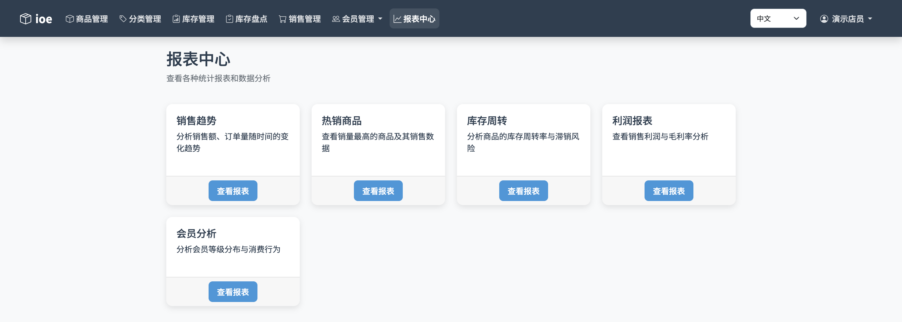
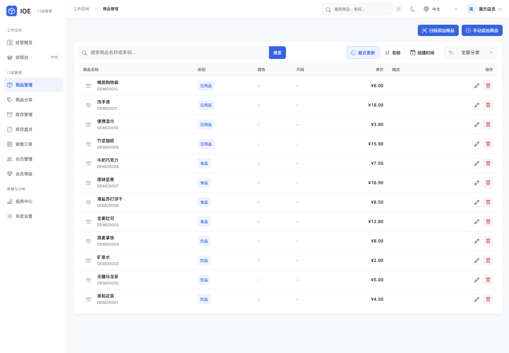
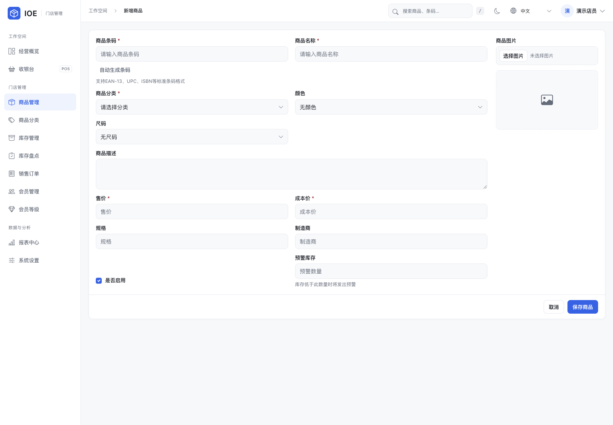
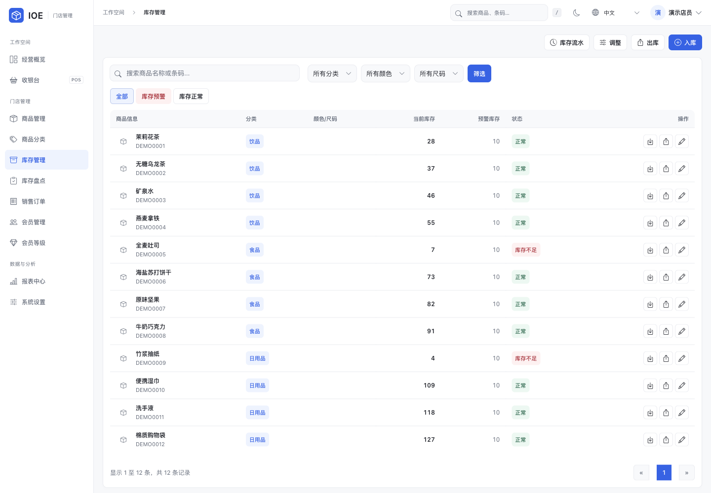

<div align="center">

# IOE 库存管理系统

**从商品入库到门店收银，把库存、销售和会员记录放在一起。**

[English](README.md) · [快速开始](#快速开始) · [界面预览](#界面预览) · [联系方式](#联系方式)

</div>

IOE 是面向小型零售门店的开源管理系统。你可以用它维护商品资料、记录出入库、扫码收银、管理会员余额与积分，并通过报表查看销售和库存变化。系统基于 Django，默认使用 SQLite，适合本地运行、自行部署和二次开发。

### 先看经营数据

按日期查看销售额、利润和订单量，再对照明细了解每天的经营情况。以下截图均来自本地演示数据。



## 能做什么

| 场景 | 功能 |
| --- | --- |
| 商品与条码 | 维护分类、价格、成本、规格和图片，通过条码查找商品。 |
| 库存与盘点 | 记录入库、出库和调整，查看库存预警与流水，按盘点结果核对库存。 |
| 门店收银 | 扫码或按名称添加商品，调整数量，应用会员折扣，记录支付方式和销售明细。 |
| 会员经营 | 管理会员等级、充值、余额、积分、消费记录和生日提醒。 |
| 报表与管理 | 查看销售趋势、库存周转等报表，管理用户权限、操作日志和数据备份。 |

日常操作围绕同一份商品、库存和会员资料展开：商品入库后可用于收银，销售产生订单和出库记录，后续可在明细与报表中查询。界面提供中英文切换和浅色、深色主题。

## 界面预览

### 库存周转：哪些商品卖得快

结合现有库存、销售数量和周转天数，辅助判断补货与库存积压情况。



### 收银台：商品、支付与结账集中操作

商品明细、会员查找和支付区域在同一页面。支持条码输入，也可以按商品名称查找。



<details>
<summary><strong>经营概览与报表入口</strong></summary>

经营概览汇总今日销售、商品与会员数量、库存提醒和近期销售走势。



报表中心集中提供销售、商品、库存和会员相关的分析入口。



</details>

<details>
<summary><strong>商品资料与库存操作</strong></summary>

商品列表支持查找与筛选，编辑页集中维护价格、规格、图片和预警库存。





库存列表展示当前数量和预警状态，并提供入库、出库与调整入口。



</details>

<details>
<summary><strong>会员管理与库存盘点</strong></summary>

查看会员资料、余额和积分，并按会员等级配置折扣。


盘点任务按状态管理，支持录入实际数量、完成盘点和审核调整。


</details>

## 快速开始

使用 Python 3.10 或更高版本。以下命令适用于 macOS / Linux；默认数据库为 SQLite，无需另外启动数据库服务。

1. 克隆项目并创建虚拟环境：

   ```bash
   git clone https://github.com/zhtyyx/ioe.git
   cd ioe
   python3 -m venv .venv
   source .venv/bin/activate
   ```

2. 安装依赖，初始化数据库并创建登录账号：

   ```bash
   python -m pip install -r requirements.txt
   python -c "from pathlib import Path; Path('db').mkdir(exist_ok=True)"
   python manage.py migrate
   python manage.py createsuperuser
   ```

3. 启动本地服务：

   ```bash
   python manage.py runserver
   ```

打开 <http://127.0.0.1:8000/>，使用刚创建的账号登录。首次运行是空数据库，README 中的演示数据不会自动导入。

Windows 用户可将 `python3` 换成 `python`，并使用 `.venv\Scripts\activate` 激活虚拟环境。

数据库保存在 `db/db.sqlite3`，上传的商品图片等文件保存在 `media/`。`runserver` 用于本地开发；容器部署、持久化配置与部署注意事项见 [Docker 部署指南](README.docker_zh.md)。

## 开发与测试

运行完整测试集：

```bash
python manage.py test --settings=inventory.test_settings
```

测试配置使用独立的临时数据库与文件目录，覆盖收银、会员余额、库存变动、并发扣库存和备份恢复等流程。

主要代码位于 `inventory/`：`models/` 定义数据结构，`views/` 和 `services/` 处理业务，`templates/` 与 `static/` 提供界面，`tests/` 保存测试。`asset/` 存放文档截图。

欢迎通过 [Issues](https://github.com/zhtyyx/ioe/issues) 反馈问题或提出功能建议。提交 PR 时请说明触发条件、预期行为和验证结果；业务改动附测试，界面改动附截图。较大的功能先讨论使用场景和范围。

## 联系方式

- 邮箱：[zhtyyx@gmail.com](mailto:zhtyyx@gmail.com)
- 问题反馈：[GitHub Issues](https://github.com/zhtyyx/ioe/issues)
- 微信：扫描下方二维码添加。

<div align="center">
  
</div>

## 支持项目

如果 IOE 对你有帮助，欢迎分享使用反馈、提交改进，或支持后续维护。

<div align="center">
  
  
</div>

## 致谢

感谢 [Linux DO 社区](https://linux.do/)。

## 许可证

IOE 采用 [MIT License](LICENSE)，可按许可证条款使用、修改和分发。
